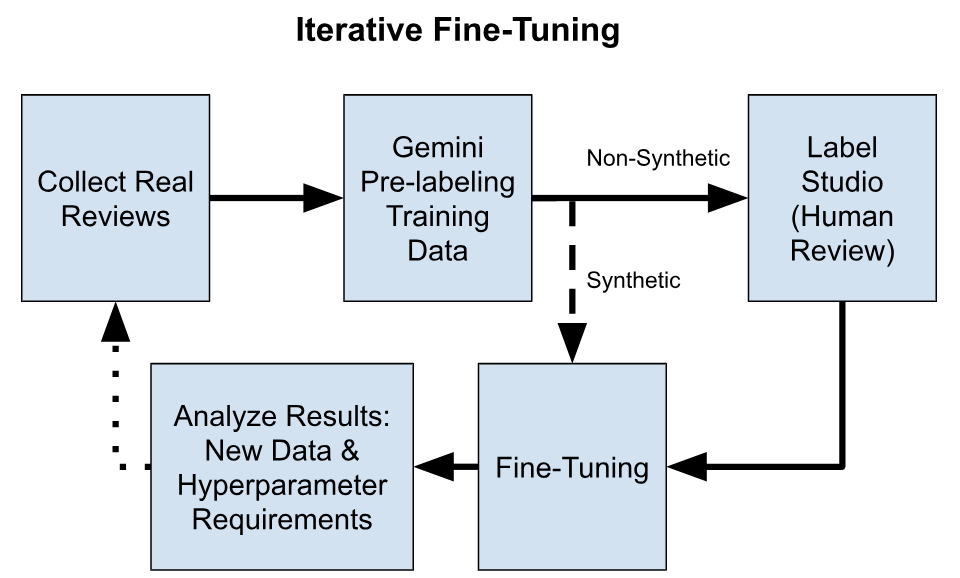
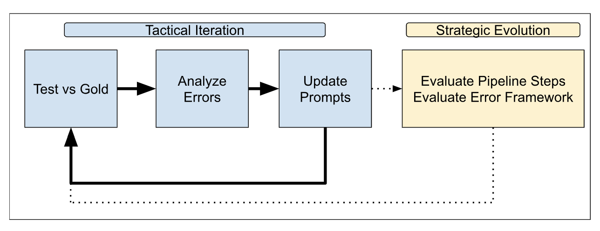
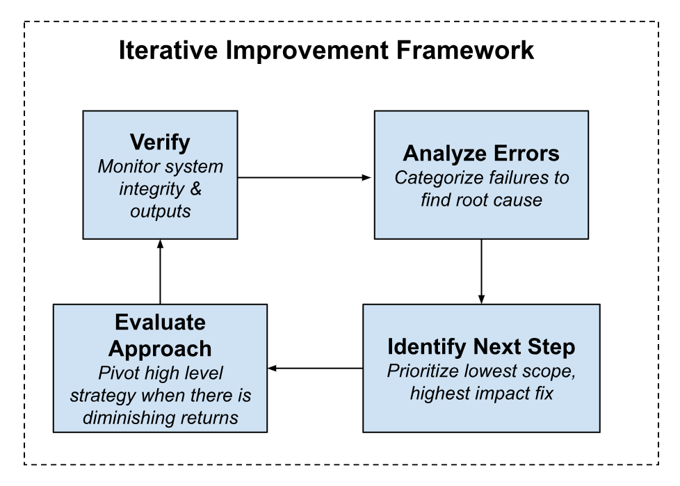
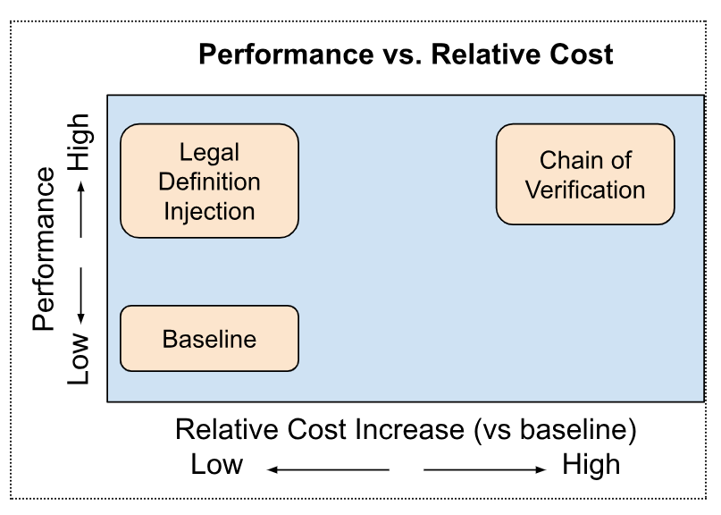

# Michael Powers - AI Product Manager
*A Product Leader leveraging a decade of consumer SaaS expertise to build innovative AI applications.*

---

## 📋 Table of Contents

1. [**About Me**](#-about-me)
2. [**Projects**](#-projects)
   - [Game Review Sentiment Analyzer](#game-review-sentiment-analyzer)
   - [Text-to-SQL System with a Custom Evaluation Framework](#text-to-sql-system-with-a-custom-evaluation-framework)
   - [Reducing LLM Hallucinations in Legal Document Analysis](#systematic-hallucination-reduction-for-high-stakes-ai)
3. [**Tech Stack**](#-tech-stack)
4. [**Contact Me**](#-contact-me)

---

## 👨‍💻 About Me

I am a product leader with over 10 years of experience, most recently as a Product Director in the live-service gaming industry. In that role, I was responsible for leading a 100 person cross functional team to deliver 0-to-1 consumer products, also leading initatives that generated eight-figure revenue growth to existing products.

Today, I am passionately applying my expertise in designing data-driven systems and user-centric development to the field of Artificial Intelligence. Through hands-on projects, I am exploring how to build, evaluate, and deploy effective AI solutions that solve real-world business problems. My goal is to leverage my deep experience in commercial product strategy to deliver impactful AI products.

<br>
<details>
  <summary><strong>View my Foundational Machine Learning Experience</strong></summary>
  <br/>
  <strong>User Churn Prediction</strong>
  <ul>
    <li><strong>Business Impact:</strong> Increased user retention</li>
    <li><strong>My Role:</strong> As the product lead, I was responsible for:</li>
     <ul>
        <li>Defining product goals and requirements</li>
        <li>Collaborating with data science on model features and telemetry</li>
        <li>Measuring business impact, evaluating ROI, and iterating on the product</li>
        <li>Partnering with marketing and other stakeholders to deliver results</li>
     </ul>
  </ul>
  <br/>
  <strong>Recommendations</strong>
  <ul>
    <li><strong>Business Impact:</strong> Improved engagement (recommended content), Increased revenue (recommended items)</li>
    <li><strong>My Role:</strong> As the product lead, I was responsible for:</li>
     <ul>
        <li>Defining product goals and requirements</li>
        <li>Collaborating with data science</li>
        <li>Measuring business impact and iterating</li>
     </ul>
  </ul>
  <br/>
  <strong>Safety - Message Classifications</strong>
  <ul>
    <li><strong>Business Impact:</strong> Increased output of customer service agents by reducing average ticket volume and reducing average time to resolve tickets</li>
    <li><strong>My Role:</strong> As the product lead, I was responsible for:</li>
     <ul>
     <li>Defining product goals and requirements</li>
        <li>Collaborating with data scientists</li>
        <li>Measuring business impact, evaluating ROI</li>
        <li>Partnering with Trust & Safety on the requirements and usage</li>
     </ul>
  </ul>
</details>

<br>
<details>
  <summary><strong>View my Core AI/ML Competencies</strong></summary>
  <br />
  <ul>
    <li><strong>Model Evaluation Frameworks:</strong> Creating custom frameworks with domain-specific metrics (custom F1 scores) to drive iterative improvements: <strong>business impact</strong> based on root-cause error analysis.</li>
  <li><strong>RAG Systems:</strong> Evaluation and implementation of Retrival-Augmented Generation architecture, including vector databases, chunking strategies, retrieval optimization</li>
  <li><strong>LLM Fine-tuning & Domain Adaptation:</strong> Adapting open-source models to specialized domains (gaming slang) through curated data and targeted fine-tuning (PEFT/QLoRA) to outperform commercial baselines.</li>
  <li><strong>Prompt Engineering:</strong> Designing, testing and refining complex prompts to reliably control LLM output quality.</li>
  <li><strong>Root Cause Error Analysis:</strong> Systematically categorizing model failures (e.g., syntax, aggregation errors) to create a data-driven roadmap for targeted improvements.</li>
   <li><strong>Benchmarking & Competitive Analysis:</strong> Situating product performance in the market by rigorously testing against external industry benchmarks (e.g., Spider 2.0) and the performance of leading commercial APIs (Gemini).</li>
  <li><strong>AI Product Strategy:</strong> Navigating the unique challenges of AI product development: making "fine-tune vs. buy" decisions, identifying high-value use cases for LLM systems, and building roadmaps that are deeply integrated with dataset strategy and evolving model capabilities.</li>
  </ul>
</details>


---

## 🚀 Projects


### Game Review Sentiment Analyzer

*A Fine-Tuned Llama 3.1 that transforms unstructured game reviews into actionable product insights.*

A pipeline to ingest game review data, process it through the LLM, and store structred JSON output in Parquet files *(for easy integration with corporate BI systems)*.

Interactive web app: Google Play Store review scraper, LLM Triggering & Data Processing, Data Visualization *(sentiment trends, negative topics, top keywords)*

<br><br>

<table>
<tr>
   <td width="50%" valign="top">
   <strong>Fine-Tuning Workflow</strong><br>  
   <em>This diagram shows the iterative process of data collection, labeling, training, and evaluation.</em><br><br>
      
   </td> 
   <td width="50%" valign="top">
      <strong>Demo Video</strong><br>
      <em>Watch a walkthrough of the final Streamlit application, including the review scraper and visualizations.</em><br><br>
      <a href="https://www.youtube.com/watch?v=GEMb5UU9f1c">
      
      </a> </td>
 
</tr>
</table>

<br><br>
**Model Performance vs Baselines (custom F1 scoring metrics):**
<br/>
The fine-tuned model (v12) shows a **24% improvement** in keyword extraction and outperforms commercial models like Gemini on the overall F1 score.
<br/>

| Model Version | Overall Score | Sentiment(F1) | Neg Tracker(F1) | Keywords(F1) |
|:-------------:|:-------------:|:-------------:|:---------------:|:------------:|
| Llama Baseline|         0.810 |         0.877 |            0.95 |        0.580 |
| **Fine-Tune V12**|**0.861**|0.894|**0.96**|**0.718**|
| Gemini 2.0 flash*| 0.855 | **0.916** | 0.95 | 0.677 |
| Gemini 2.5 pro|0.831|0.894|0.90|0.679|

<br>
<br>

**Resources:**
*  **[📄 Case Study PDF](https://drive.google.com/file/d/1koWwpR_HF0uuJ62mFEIfTVbETOdfyU2d/view?usp=sharing)**
*  **[📁 GitHub Repo](https://github.com/mpowers79/llama-game-review-analyzer)**
*  **💾 Run locally with Ollama**: ```ollama run hf.co/MrMike42/GameReview-llama3.1-8b-v12-Q4_K_M-GGUF```
*  **🛠️ Tech Stack:** Python | Streamlit | Llama 3.1 8b | Unsloth | Pandas | google-play-scraper | Ollama | Llama-Index | PyArrow | Jupyter
*  **📝 Articles:**
   * [JSON Test Data Workflow with Gemini & Label Stuido](https://medium.com/@michael.sean.powers/llm-fine-tuning-json-test-data-workflow-with-gemini-label-studio-ea1e0657c7f4)
   * [LLM Fine-tuning: What Tutorials Don't Show You](https://medium.com/@michael.sean.powers/llm-fine-tuning-what-tutorials-dont-show-you-33819db5df8f)
   * [Hyperparameter Tuning: How I Used Data-Driven Decisions to Stop Winging It](https://medium.com/@michael.sean.powers/hyperparameter-tuning-how-i-used-data-driven-decisions-to-stop-winging-it-625dd28d5dc4)
   * [Evaluating LLMs for Business Impact](https://www.linkedin.com/pulse/evaluating-llms-business-impact-deep-dive-custom-metrics-powers-wowqc)
   * [Transforming Game Reviews into Actionable Data](https://www.linkedin.com/pulse/transforming-game-reviews-actionable-data-my-solution-michael-powers-e6ivc)

<br>

---

### Text-to-SQL System with a Custom Evaluation Framework

*An advanced RAG pipeline for Text-to-SQL, built and improved using a custom, multi-layered evaluation framework to drive accuracy and user trust through transparency.*

**Key Features & Accomplishments:**
* **Developed a Custom Evaluation Framework:** Created a systematic process to find, categorize, and reduce query errors, which was the core of this project.
* **Engineered a Multi-Step RAG Pipeline:** Designed a pipeline that outperforms single-LLM calls for complex queries.
* **Achieved 3x Accuracy Improvement:** The evaluation-driven approach tripled the execution accuracy on the Spider 2.0 benchmark compared to the baseline.
* **Designed for User Trust:** The UI includes "glass box" features to transparently show users how the SQL was generated and where the data originated.

<br>
<table>
<tr>
   <td width="50%" valign="top">
   <strong>Evaluation Framework</strong><br>  
   <em>The core of this project: a framework to systematically find, categorize, and reduce errors.</em><br><br>
      
   </td>
   <td width="50%" valign="top">
    <strong>Demo Video</strong><br>
   <em>A walkthrough of the UI, showing how the system builds user trust through transparency.</em><br><br>
   <a href="https://www.youtube.com/watch?v=D0hAzraHf48">
   
   </a> 
   </td>
</tr>
</table>

<br><br>
**Performance Results: 3x Accuracy Improvement**

*The new pipeline achieved a **~15% reduction in total errors** and a **~50% reduction in critical Syntax and Aggregation errors** versus the baseline model.*

 **Error Reduction Analysis (New Pipeline vs. Baseline):**

|Error Category	| Baseline Errors	| New Pipeline Errors	| Reduction|
|---------------|-----------------|---------------------|----------|
|Total Errors	| 113 |	96	| ~15% |
|Syntax Errors |	14 |	7 |	~50% |
|Aggregation Errors |	21 |	10	| ~52% |
|Join Errors	| 18 |	15 |	~17% |
<br>
<br>

**Resources:**
*  **[📄 Case Study PDF](https://drive.google.com/file/d/1jpBpiKcWMY3yCzQQGMGHxVpeUac9uA95/view?usp=sharing)**
*  **[📁 GitHub Repo](https://github.com/mpowers79/RAG-to-SQL)**
*  **🛠️ Tech Stack:** Python | Streamlit | Google Gemini | Llama-index | Ollama | ChromaDB | Jupyter Notebooks | SQLite
*  **📝 Articles:**
   * [Product Manager's Guide to Building LLM Evaluation Frameworks](https://medium.com/@michael.sean.powers/a-product-managers-guide-to-building-llm-evaluation-frameworks-2a4a15d8c63d)
   * [Building a Transparent and Improvable Text-to-SQL System](https://www.linkedin.com/pulse/building-transparent-improvable-text-to-sql-system-michael-powers-xjric)
   * [A Practical Approach to Trusting AI in Business Data](https://www.linkedin.com/pulse/glass-box-practical-approach-trusting-ai-business-data-michael-powers-1zyyc)
   * [I've Spent Years Analyzing Data. Here's How It Taught Me to Build Trustworthy AI](https://medium.com/@michael.sean.powers/ive-spent-years-analyzing-data-here-s-how-it-taught-me-to-build-trustworthy-ai-e58b605bfb9f)

---

### Systematic Hallucination Reduction for High-Stakes AI

*A project demonstrating how systematic error analysis can outperform complex industry-standard methods for a fraction of the cost.*

**Key Features & Accomplishments:**
* **Established a Data-Driven Framework:** Developed a repeatable 4-step process (Verify -> Analyze -> Identify -> Evaluate) to systematically diagnose and mitigate LLM errors.
* **Performed a Deep Root-Cause Analysis:** Identified 'semantic misunderstanding' as the primary driver of hallucinations in the legal dataset, a critical insight that guided the solution.
* **Engineered a High-ROI Solution:** Implemented a low cost "Legal Definition Injection" method that was more performant and more cost-efficient than the complex Chain of Verification pipeline.
* **Created a Rigorous Testbed:** Deliberately constructed a challenging dataset where ~70% of questions were unanswerable to rigorously test model factuality in a "worst-case scenario."
<br>
<table>
<tr>
<td width="50%" valign="top">
<strong>My Iterative Improvement Framework</strong><br>
<em>The data-driven process used to guide experimentation, from initial failure to the final, optimal solution.</em><br><br>

</td>
<td width="50%" valign="top">
<strong>The Result: A High-ROI Solution</strong><br>
<em>The final solution achieved the highest performance for the lowest relative cost.</em><br><br>

</a>
</td>
</tr>
</table>
<br><br>

**Performance Results: Targeted Solution Outperforms Complex Pipeline at lower Cost**

*The "Legal Definition Injection" method delivered the highest F1-Score while only increasing baseline costs by 1.3%, compared to the 16% cost increase from the complex Chain of Verification pipeline.*

**Solution Comparison (Performance vs. Cost):**

| Approach                 | F1-Score | Precision | Cost vs Baseline |
| :----------------------- | :------- | :-------- |:----------------- |
| **Baseline**             | 0.28     | 16.8%      |N/A                |
| **Simple Improvements** | 0.27 | 19.1% | +5% |
| **Chain of Verification**  | 0.36     | 40.5%      |+16%               |
| **Legal Definition Injection** | **0.47** | **46.8%**  |**+1.3%**          |

<br>
<br>

**Resources:**
* **[📄 Case Study PDF](https://drive.google.com/file/d/1dlp7Ti-VaR8jo69H9i8HXf-v8nUuD-_R/view?usp=sharing)**
* **[📁 GitHub Repo](https://github.com/mpowers79/llm-hallucinations)**
* **🛠️ Tech Stack:** Python | Google Gemini | Pandas | NumPy | Jupyter Notebooks
* **📝 Articles:**
   * Coming soon
<br>

---

## 🛠️ Tech Stack

<br/>

**AI & LLM Frameworks**
<table>
  <tr>
    <td align="center" width="96">
      
      <br/>Llama - Index
    </td>
    <td align="center" width="96">
      
      <br/>Unsloth
    </td>
  <td align="center" width="96">
      
      <br/>Ollama
  </td>
  </tr>
</table>

**Data Processing & Databases**
<table>
  <tr>
    <td align="center" width="96">
      
      <br/>Pandas </td>
  <td align="center" width="96">
      
      <br/>ChromaDB</td>
    <td align="center" width="96">
      
      <br/>SQlite</td>
  <td align="center" width="96">
     
    <br/>PyArrow</td>
  </tr>
</table>

**Core Language & Application**
<table>
  <tr>
     <td align="center" width="96">
      
      <br/>Python</td>
    <td align="center" width="96">
      
      <br/>Streamlit</td>
  </tr>
</table>

**Development Platforms & Tools**
<table>
  <tr>
     <td align="center" width="96">
      
      <br/>Docker</td>
    <td align="center" width="96">
      
      <br/>Jupyter Notebooks</td>
    <td align="center" width="96">
      
      <br/>Google Colab</td>
    <td align="center" width="96">
      
      <br/>Kaggle</td>
  </tr>
</table>
  
  ---

## 📫 Contact Me

[Connect with me on LinkedIn](https://www.linkedin.com/in/michaelspowers/)

[michael.sean.powers@gmail.com](mailto:michael.sean.powers@gmail.com)

*For professional inquiries, including job opportunities, please connect with me on Linkedin or send an email.*

 
